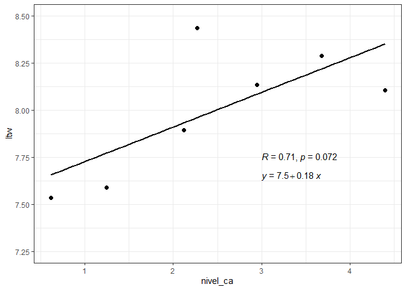
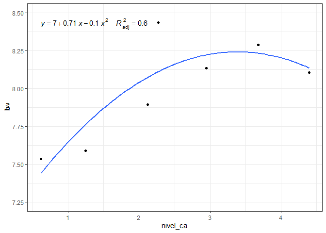
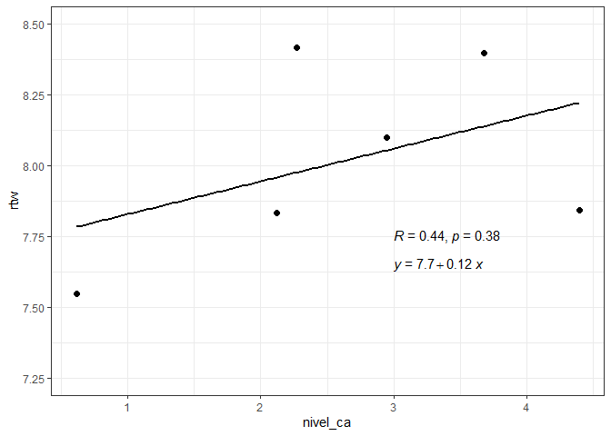
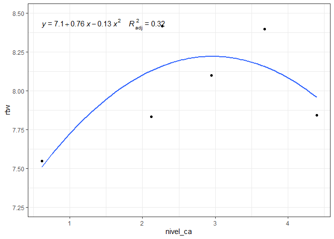
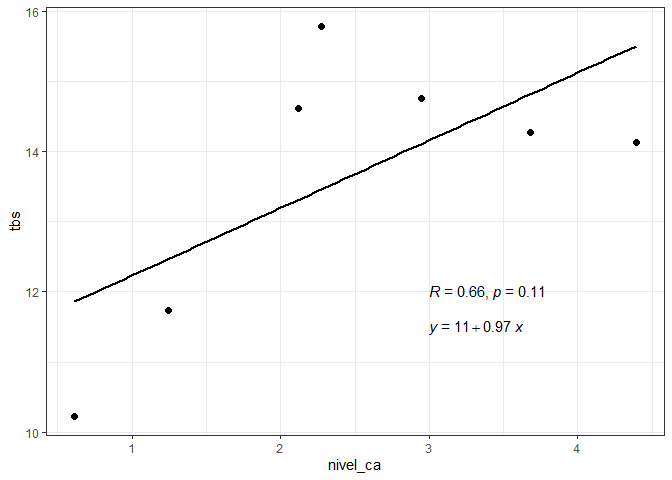
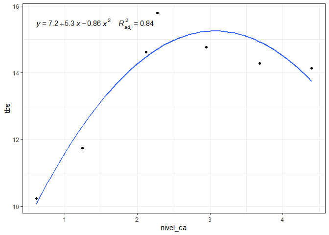

<!-- README.md is generated from README.Rmd. Please edit that file -->

# Carregando Pacotes

``` r
library(tidyverse)
library(ggpubr)
```

# Entrada de dados

``` r
dados <- readxl::read_xlsx("data/BodyComposition.xlsx") %>% 
  janitor::clean_names()
glimpse(dados)
#> Rows: 49
#> Columns: 6
#> $ trat     <dbl> 1, 1, 1, 1, 1, 1, 1, 2, 2, 2, 2, 2, 2, 2, 3, 3, 3, 3, 3, 3, 3~
#> $ rep      <dbl> 1, 2, 3, 4, 5, 6, 7, 1, 2, 3, 4, 5, 6, 7, 1, 2, 3, 4, 5, 6, 7~
#> $ nivel_ca <dbl> 0.6129, 0.6129, 0.6129, 0.6129, 0.6129, 0.6129, 0.6129, 1.241~
#> $ ltw      <dbl> 6.700000, 7.800000, 6.640000, 8.100000, 7.540000, 8.300000, 7~
#> $ rtw      <dbl> 6.660000, 8.190000, 6.340000, 8.110000, 7.460000, 8.250000, 7~
#> $ tbs      <dbl> 8.56272, 9.24845, 10.12762, 13.05163, 7.44280, 11.21479, 11.9~
```

# Médias com respectivos desvio padrões

``` r
dados %>% 
  group_by(nivel_ca) %>% 
  summarise(
    ltw_media = mean(ltw, na.rm=TRUE),
    ltw_DP = sd(ltw, na.rm=TRUE),
    rtw_media = mean(rtw, na.rm=TRUE),
    rtw_DP = sd(rtw, na.rm=TRUE),
    tbs_media = mean(tbs, na.rm=TRUE),
    tbs_DP = sd(tbs, na.rm=TRUE)
  )
#> # A tibble: 7 x 7
#>   nivel_ca ltw_media ltw_DP rtw_media rtw_DP tbs_media tbs_DP
#>      <dbl>     <dbl>  <dbl>     <dbl>  <dbl>     <dbl>  <dbl>
#> 1    0.613      7.53  0.644      7.55  0.769      10.2  1.98 
#> 2    1.24       7.59  0.620      7.19  0.573      11.7  2.25 
#> 3    2.12       7.89  0.767      7.83  0.848      14.6  1.72 
#> 4    2.27       8.44  0.931      8.42  0.980      15.8  2.76 
#> 5    2.95       8.14  0.580      8.10  0.523      14.8  1.14 
#> 6    3.68       8.29  0.406      8.40  0.522      14.3  0.970
#> 7    4.39       8.10  0.584      7.84  0.734      14.1  3.03
```

## Análise de regressão para 

### Linear

``` r
modelo <- lm(ltw ~ nivel_ca,
             data=dados)
summary(modelo)
#> 
#> Call:
#> lm(formula = ltw ~ nivel_ca, data = dados)
#> 
#> Residuals:
#>      Min       1Q   Median       3Q      Max 
#> -1.24152 -0.24520  0.00423  0.44423  2.46880 
#> 
#> Coefficients:
#>             Estimate Std. Error t value Pr(>|t|)    
#> (Intercept)  7.54294    0.21440  35.182   <2e-16 ***
#> nivel_ca     0.18409    0.07784   2.365   0.0222 *  
#> ---
#> Signif. codes:  0 '***' 0.001 '**' 0.01 '*' 0.05 '.' 0.1 ' ' 1
#> 
#> Residual standard error: 0.668 on 47 degrees of freedom
#> Multiple R-squared:  0.1064, Adjusted R-squared:  0.08734 
#> F-statistic: 5.593 on 1 and 47 DF,  p-value: 0.02221
dados %>% 
  group_by(nivel_ca) %>% 
  summarise(
    ltw = mean(ltw)
  ) %>% 
  ggscatter(x = "nivel_ca", y = "ltw", add = "reg.line") +
  stat_cor(label.x = 3, label.y = 7.75) +
  stat_regline_equation(label.x = 3, label.y = 7.65) +
  ylim(c(7.25,8.5)) +
  theme_bw()
```

<!-- -->

### Quadrático

``` r
modelo <- lm(ltw ~ nivel_ca + nivel_ca2,
             data=dados %>% 
               mutate(
               nivel_ca2 = nivel_ca^2)
)
dados %>% 
  group_by(nivel_ca) %>% 
  summarise(
    ltw = mean(ltw)
  ) %>% 
  ggplot(aes(x = nivel_ca, y=ltw)) +
  geom_point() +
  stat_smooth(method = "lm", formula = y ~ x + I(x^2),se=FALSE) +
  stat_regline_equation(aes(label =  paste(..eq.label.., ..adj.rr.label.., sep = "~~~~")),formula = y ~ x + I(x^2)) +
  ylim(c(7.25,8.5)) +
  theme_bw()
```

<!-- -->

## Análise de regressão para 

### Linear

``` r
modelo <- lm(rtw ~ nivel_ca,
             data=dados)
summary(modelo)
#> 
#> Call:
#> lm(formula = rtw ~ nivel_ca, data = dados)
#> 
#> Residuals:
#>     Min      1Q  Median      3Q     Max 
#> -1.2970 -0.5568  0.0634  0.5332  2.6338 
#> 
#> Coefficients:
#>             Estimate Std. Error t value Pr(>|t|)    
#> (Intercept)  7.42651    0.24627  30.156   <2e-16 ***
#> nivel_ca     0.19353    0.08941   2.165   0.0355 *  
#> ---
#> Signif. codes:  0 '***' 0.001 '**' 0.01 '*' 0.05 '.' 0.1 ' ' 1
#> 
#> Residual standard error: 0.7673 on 47 degrees of freedom
#> Multiple R-squared:  0.09066,    Adjusted R-squared:  0.07131 
#> F-statistic: 4.686 on 1 and 47 DF,  p-value: 0.03553
dados %>% 
  group_by(nivel_ca) %>% 
  summarise(
    rtw = mean(rtw)
  ) %>% 
  ggscatter(x = "nivel_ca", y = "rtw", add = "reg.line") +
  stat_cor(label.x = 3, label.y = 7.75) +
  stat_regline_equation(label.x = 3, label.y = 7.65) +
  ylim(c(7.25,8.5)) +
  theme_bw()
```

<!-- -->

### Quadrático

``` r
modelo <- lm(rtw ~ nivel_ca + nivel_ca2,
             data=dados %>% 
               mutate(
               nivel_ca2 = nivel_ca^2)
)
summary(modelo)
#> 
#> Call:
#> lm(formula = rtw ~ nivel_ca + nivel_ca2, data = dados %>% mutate(nivel_ca2 = nivel_ca^2))
#> 
#> Residuals:
#>      Min       1Q   Median       3Q      Max 
#> -1.27452 -0.54181 -0.07295  0.54548  2.44049 
#> 
#> Coefficients:
#>             Estimate Std. Error t value Pr(>|t|)    
#> (Intercept)  6.79044    0.43187  15.723   <2e-16 ***
#> nivel_ca     0.86138    0.38642   2.229   0.0307 *  
#> nivel_ca2   -0.13328    0.07512  -1.774   0.0826 .  
#> ---
#> Signif. codes:  0 '***' 0.001 '**' 0.01 '*' 0.05 '.' 0.1 ' ' 1
#> 
#> Residual standard error: 0.7503 on 46 degrees of freedom
#> Multiple R-squared:  0.1489, Adjusted R-squared:  0.1119 
#> F-statistic: 4.024 on 2 and 46 DF,  p-value: 0.02452
dados %>% 
  group_by(nivel_ca) %>% 
  summarise(
    rtw = mean(rtw)
  ) %>% 
  ggplot(aes(x = nivel_ca, y=rtw)) +
  geom_point() +
  stat_smooth(method = "lm", formula = y ~ x + I(x^2),se=FALSE) +
  stat_regline_equation(aes(label =  paste(..eq.label.., ..adj.rr.label.., sep = "~~~~")),formula = y ~ x + I(x^2)) +
  ylim(c(7.25,8.5)) +
  theme_bw()
```

<!-- -->

## Análise de regressão para 

### Linear

``` r
modelo <- lm(tbs ~ nivel_ca,
             data=dados)
summary(modelo)
#> 
#> Call:
#> lm(formula = tbs ~ nivel_ca, data = dados)
#> 
#> Residuals:
#>     Min      1Q  Median      3Q     Max 
#> -5.4717 -1.4993  0.0432  1.1930  6.0945 
#> 
#> Coefficients:
#>             Estimate Std. Error t value Pr(>|t|)    
#> (Intercept)  11.2664     0.7781   14.48   <2e-16 ***
#> nivel_ca      0.9662     0.2825    3.42   0.0013 ** 
#> ---
#> Signif. codes:  0 '***' 0.001 '**' 0.01 '*' 0.05 '.' 0.1 ' ' 1
#> 
#> Residual standard error: 2.424 on 47 degrees of freedom
#> Multiple R-squared:  0.1993, Adjusted R-squared:  0.1822 
#> F-statistic:  11.7 on 1 and 47 DF,  p-value: 0.001304
dados %>% 
  group_by(nivel_ca) %>% 
  summarise(
    tbs = mean(tbs)
  ) %>% 
  ggscatter(x = "nivel_ca", y = "tbs", add = "reg.line") +
  stat_cor(label.x = 3, label.y = 12) +
  stat_regline_equation(label.x = 3, label.y = 11.5)+
  theme_bw()
```

<!-- -->

### Quadrático

``` r
modelo <- lm(tbs ~ nivel_ca + nivel_ca2,
             data=dados %>% 
               mutate(
               nivel_ca2 = nivel_ca^2)
)
summary(modelo)
#> 
#> Call:
#> lm(formula = tbs ~ nivel_ca + nivel_ca2, data = dados %>% mutate(nivel_ca2 = nivel_ca^2))
#> 
#> Residuals:
#>     Min      1Q  Median      3Q     Max 
#> -4.1498 -1.2459 -0.4411  1.2569  4.8510 
#> 
#> Coefficients:
#>             Estimate Std. Error t value Pr(>|t|)    
#> (Intercept)   7.1739     1.2087   5.935 3.62e-07 ***
#> nivel_ca      5.2632     1.0815   4.866 1.37e-05 ***
#> nivel_ca2    -0.8576     0.2102  -4.079 0.000178 ***
#> ---
#> Signif. codes:  0 '***' 0.001 '**' 0.01 '*' 0.05 '.' 0.1 ' ' 1
#> 
#> Residual standard error: 2.1 on 46 degrees of freedom
#> Multiple R-squared:  0.412,  Adjusted R-squared:  0.3864 
#> F-statistic: 16.11 on 2 and 46 DF,  p-value: 4.968e-06
dados %>% 
  group_by(nivel_ca) %>% 
  summarise(
    tbs = mean(tbs)
  ) %>% 
  ggplot(aes(x = nivel_ca, y=tbs)) +
  geom_point() +
  stat_smooth(method = "lm", formula = y ~ x + I(x^2),se=FALSE) +
  stat_regline_equation(aes(label =  paste(..eq.label.., ..adj.rr.label.., sep = "~~~~")),formula = y ~ x + I(x^2)) +
  theme_bw()
```

<!-- -->
